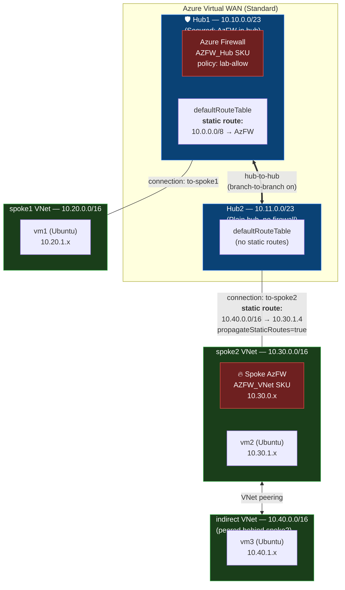
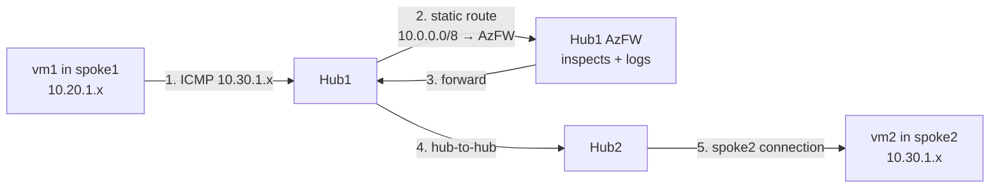
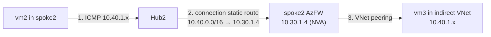
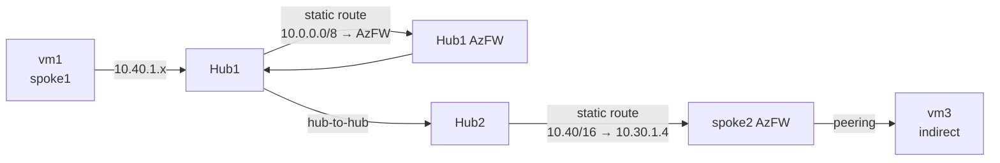

# vwan-sr Architecture

## Topology Overview

## Static Route Demonstrations

### Use Case 1 — AzFW in hub (Hub1)

- vm1 → vm2 traffic transits Hub1 AzFW for inspection.
- Routing intent must be **disabled** for this pattern (using static routes in hub route table).

### Use Case 2 — NVA (AzFW) in spoke (Hub2 → indirect)

- Static route lives on the **Hub2→spoke2 VNet connection**, next-hop = spoke2 AzFW private IP.
- `propagateStaticRoutes = true` advertises 10.40/16 back to Hub2's route tables → other connections inherit it.
- This is **Option 1** in the MS docs and is **compatible with routing intent** (we don't enable it here, but you could).

### Combined hybrid flow (vm1 → vm3)

Two firewalls in series — Hub1 AzFW (hub-attached) inspects east-west, spoke2 AzFW (spoke-deployed NVA) acts as next-hop into the indirect spoke.

## Address Plan

| Resource | CIDR | Notes |
|---|---|---|
| Hub1 | 10.10.0.0/23 | secured w/ AzFW |
| Hub2 | 10.11.0.0/23 | plain |
| spoke1 | 10.20.0.0/16 | vms subnet 10.20.1.0/24 |
| spoke2 | 10.30.0.0/16 | AzureFirewallSubnet 10.30.0.0/26, vms 10.30.1.0/24 |
| indirect | 10.40.0.0/16 | vms 10.40.1.0/24, peered to spoke2 |

## Key Design Choices vs Routing Intent

| Pattern | Used in Lab | Compatible with Routing Intent? |
|---|---|---|
| Static route in hub route table → AzFW resource ID | ✅ Hub1 | ❌ No (mutually exclusive) |
| Static route on VNet connection → IP, `propagate=true` | ✅ Hub2 → spoke2 | ✅ Yes (Option 1) |
| Static route in hub route table → VNet connection + matching IP on connection | ❌ Not used | ❌ No (Option 2) |
| NVA inside the vWAN hub | ❌ Not used | requires Routing Intent |

See [PLAN.md](./PLAN.md) for the full design rationale and the MS doc summary.
